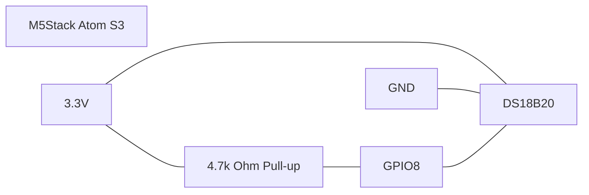

# DS18B20 Conventions

## Naming

- Keep the existing device substitutions unchanged: `device_name` and `friendly_name`
- Use `equipment_temp` for the current DS18B20 sensor id unless the repo intentionally adds more probes
- Prefer descriptive ids such as `water_temp` or `return_line_temp` when adding additional probes

## Wiring

- Use the M5Stack Atom S3 with the DS18B20 data line on `GPIO8`
- Keep the 4.7 kOhm pull-up resistor between `3.3V` and the 1-Wire data line
- Use 3-wire wiring unless there is a confirmed reason to use parasite power



## ESPHome Style

- Use `one_wire` for the bus definition
- Use `platform: dallas_temp` for DS18B20 sensors in this repository
- Convert Celsius to Fahrenheit with `multiply: 1.8` and `offset: 32.0` when exposing the sensor like the current config
- Add an explicit `address:` only when more than one sensor is present on the same 1-Wire bus

## Address Handling

- Discover addresses from ESPHome logs
- Never invent ROM addresses
- Keep placeholder addresses obviously fake in documentation examples

## Valid Example Fragments

Single probe on the existing bus:

```yaml
one_wire:
  - platform: gpio
    pin: GPIO8

sensor:
  - platform: dallas_temp
    name: "Pool Equipment Temperature"
    id: equipment_temp
    unit_of_measurement: "°F"
    device_class: temperature
    state_class: measurement
    update_interval: 30s
    filters:
      - multiply: 1.8
      - offset: 32.0
```

Two probes on the same bus:

```yaml
one_wire:
  - platform: gpio
    pin: GPIO8

sensor:
  - platform: dallas_temp
    name: "Pool Equipment Temperature"
    id: equipment_temp
    address: 0x1111111111111128
    unit_of_measurement: "°F"
    device_class: temperature
    state_class: measurement
    update_interval: 30s
    filters:
      - multiply: 1.8
      - offset: 32.0

  - platform: dallas_temp
    name: "Return Line Temperature"
    id: return_line_temp
    address: 0x2222222222222228
    unit_of_measurement: "°F"
    device_class: temperature
    state_class: measurement
    update_interval: 30s
    filters:
      - multiply: 1.8
      - offset: 32.0
```
